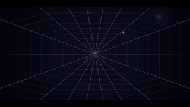

# Auto-repairing spider web

A dynamic, physics-based spider web simulation built purely with HTML, CSS, and vanilla JavaScript. 

Watch as an autonomous spider constructs a web in real-time, starting with radial spokes from the center to the screen edges, followed by a concentric spiral structure. The web reacts to physics, simulating wind and gravity through Verlet integration. 

## Features

- **Autonomous Web Building:** The spider is driven by a state machine that directs it to build a realistic web structure step-by-step.
- **Verlet Physics Engine:** The web strands and nodes respond dynamically to gravity, wind, and tension.
- **Interactive Damage & Repair:** Interacting with the simulation allows you to break or snap web strands. The spider detects the damage, re-homes drifted nodes, and autonomously repairs the broken connections!
- **Dynamic Ramp-up & Tuning:** The spider's movement and simulation speeds dynamically scale to keep the experience engaging.
- **Zero Dependencies:** A lightweight project containing only static files, meant for immediate deployment.

## Running Locally

Because this is a static web page with zero build dependencies, you can run it right out of the box:
1. Clone the repository.
2. Open `index.html` in your web browser.
3. Tap or click to start building!

## Deployment

Since it's highly optimized and relies solely on frontend capabilities, this project is completely ready to deploy on any static hosting server like GitHub Pages.

## Technical Details
- **Physics Integration:** The custom physics engine utilizes Verlet integration specifically to model soft-body string tension and dynamics across the web nodes.
- **State Machine:** Built around a concise behavior state machine, dictating spider behaviors from generating spokes, tracking to connection points, sleeping, and waking up to handle required repairs.
- **Responsive Canvas:** Fluid resizing handles full-screen displays across devices gracefully.
